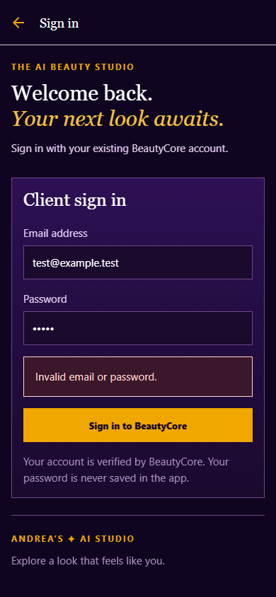
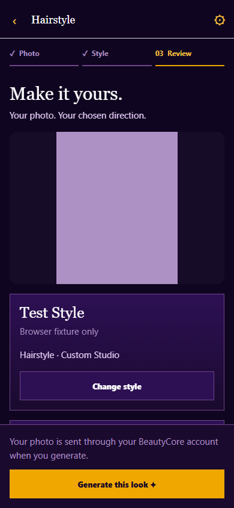
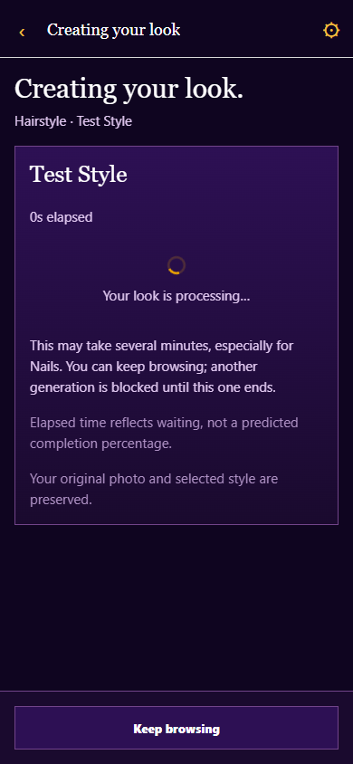
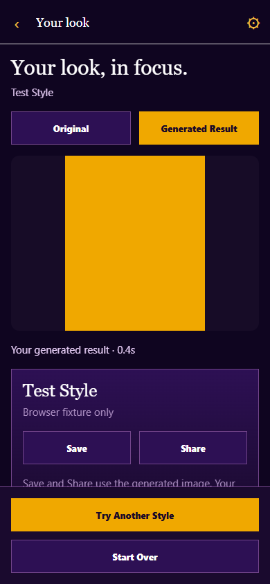
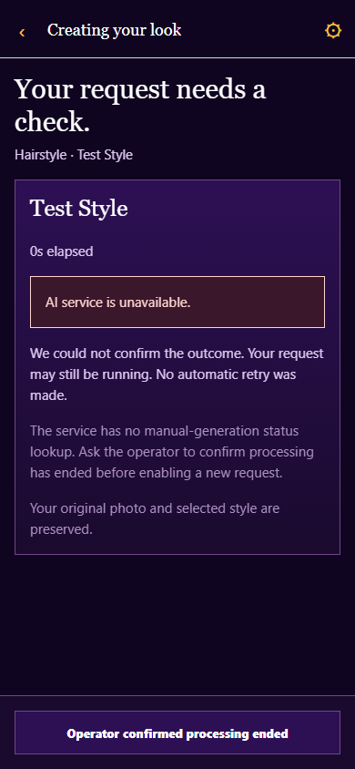

# MOBILE-02B authenticated real generation

2026-10-03, branch `codex/mobile-02`, baseline `a58a895`.

**Status: IN PROGRESS. Implementation and core checks VERIFIED; complete Android acceptance deferred by Supervisor.** Hair is accepted end to end. Makeup returned real results through the server, but phone visual acceptance is pending. No real Nails request was run. Supervisor selected core reliability and completion of current checks instead of more Makeup/Nails acceptance. This is not MOBILE_02B_READY.

## Authentication and exact application boundary

Native SDK 57 global Expo fetch uses `credentials: include` and the existing OS cookie jar. The app never reads or persists the HttpOnly cookie or password. Login verifies a subsequent session and protected Client catalog, and stores only public user identity. Supervisor reported all catalogs/session navigation load correctly on the Xiaomi Expo Go phone. Authenticated Hair generation independently exercised fresh database Client authorization.

BeautyCore remains the identity authority: existing seven day JWT cookie, HttpOnly, SameSite=Lax, Secure in production, current database role checks and Origin enforcement. No auth server code, database schema or token architecture changed. Logout deletes the current cookie and mobile clears drafts/results after verifying session null. This preserves existing stateless logout semantics; it does not add server revocation of previously copied JWTs.

Mobile `http://127.0.0.1:3000` → `/api/auth/{login,session,logout}` and `/api/ai/features/{feature}/{styles,generate}` → existing allowlisted BeautyCore adapter → private FastAPI `127.0.0.1:8000` → existing unified Kaggle worker. Feature IDs are `hairstyle`, `makeup`, `nails`. Discovery also uses `/api/ai/features`. Settings checks session reachability and authenticated catalog access rather than an invented health route.

NextURL normalizes loopback hosts to localhost before its adapter Origin comparison. The native mutation Origin mirrors that inspected normalization, while transport and cookies remain bound to the configured host. Real invalid image/style probes initially exposed the mismatch with 403; after the client correction, the same valid Origin reaches expected 400 validation rejection. Wrong Origin still returns 403. Production non-loopback origins remain unchanged. Browser authentication was not weakened.

## Native issues reproduced and fixed

The installed Expo Go 57.0.9 lacks `ExpoMediaLibraryNext`. Using the supported `expo-media-library/legacy` import eliminated the startup error, confirmed by Supervisor. Android Save uses the system folder chooser and writes only to the selected granted directory; cancellation and write failures are explicit. No broad gallery permission is required. iOS uses add-only legacy media permission with denial/settings handling; iOS runtime was not tested.

SDK 57 installs Expo fetch globally. Its actual multipart encoder rejects older RN `{uri,name,type}` values before transport. Server logs confirmed the original Hair failure never reached BeautyCore/FastAPI. A test reproduces that encoder rejection and verifies its supported File bytes interface. Upload now appends an existing filesystem File with `image` and `style_id`, preserving the chosen local photo and automatic multipart boundary. The subsequent real Hair request succeeded.

## Generation, errors and result actions

One in-memory operation across services locks before asynchronous photo preparation and survives ordinary rendering/navigation. Generation has no short mobile deadline, matching existing web semantics and preserving remote timeout settings. No automatic POST retry, fake percentage, simulation timer or mock result path remains. The generating screen shows service/style and real elapsed time. Completion redirects only while that screen is focused, so browsing does not unexpectedly replace Home.

Definitive validation/auth rejection allows explicit manual retry. Network/response loss, malformed output, 409 and upstream 5xx retain an uncertainty lock. Back, Reset and logout cannot silently unlock uncertain work. The existing manual contract has no job/status lookup or idempotency key, so an explicit operator confirmation that processing ended is required before another request. App reload/termination is not a durable job system; keep the app open and do not reload during GPU processing.

The result uses the returned inline PNG/JPEG and a snapshot of the local original. Original/Generated Result, selected style, Try Another Style and Start Over retain the existing product flow. Android Save writes a result to the user chosen folder. Share opens the native sharing sheet using a temporary cache file cleaned after use, with no automatic sharing to a recipient. Supervisor answered “It works” to the Hair result/comparison/Save/Share/Try Another checklist. Images were not copied from the phone or stored in this evidence record.

## Live requests

| Feature/style | Central FastAPI time | Remote time | Acceptance |
| --- | --- | --- | --- |
| Hair, `crew_cut` | 66.032 s | 65.407 s | HTTP 200 through BeautyCore and Kaggle; Supervisor confirmed real phone result/actions |
| Makeup, `soft_glam` | 63.453 s | 62.844 s | HTTP 200 through BeautyCore and Kaggle; phone visual acceptance deferred |
| Makeup, `classic_red_lip` | 64.594 s | 63.969 s | Additional Client request, HTTP 200; phone visual acceptance deferred |
| Nails | No live request | No live request | Pending; do not infer a model/renderer result from source |

These are measured server times, not reported phone screen times. All three observed remote requests recorded attempt 1 and automatic_retry false. [Allowlisted diagnostic events](mobile-02b-assets/live-requests.json) contain request identity/style/status/timing only, no images, passwords, cookies, remote URLs or credentials.

Existing Nails routing is preserved in source: Classic Red/Glossy Black use localized model crops, other existing styles use the renderer, with unchanged segmentation/compositing. Actual Android Nails path and timing still require a real result.

## Checks and limitations

TypeScript, lint and 23 mobile tests passed. The tests cover native credentials/Origin, multipart contracts, long requests, rejection of mock/malformed results, duplicate calls across services, local preparation failure, controlled errors, manual retry and uncertain outcome protection. Expo compatibility check passed; Doctor passed 21/21; final Android and web exports passed.

Seven intercepted PC browser groups passed at widths 320/360/390/430 without horizontal overflow or hidden bottom actions: login failure/session, Settings unavailable API/recovery, all three Photo/Style/Review flows, single POST after duplicate taps, browsing during processing, original/result, photo retention, Start Over, explicit retry, AI unavailable lock and logout protection. Five fixture generation POSTs were intercepted, with zero GPU work. These checks do not prove native cookies, gallery or live image generation. [Harness/results](mobile-02b-assets/ui-check.cjs), [check list](mobile-02b-assets/ui-checks.json).

Local existing demo identity probes verified wrong password 401, anonymous AI 401, Client catalogs 200, invalid encoded image/style 400, wrong Origin 403, Stylist AI denial 403, logout 200 followed by null session/AI 401. No database rows were created/reset or seed script run. No GPU request was made by this probe. [Probe/results](mobile-02b-assets/auth-probe.py), [status evidence](mobile-02b-assets/auth-probe.json).

Upstream unavailable/failure/lost-response behavior is tested at mocked transport boundaries, not by intentionally breaking the live Kaggle worker. Native module and initial multipart failures were reproduced on the actual phone. Supervisor reported “it looks good” to the final Home/Settings/Consultation/Back/Start Over/logout core checklist; that broad manual response is recorded as such, not an independently inspected native logout trace. Full Makeup/Nails manual gallery/back/real-result acceptance and isolated native logout confirmation remain to be closed.

Backend regression: 408 passed (one existing multipart deprecation warning). BeautyCore typecheck and 26 adapter/client/studio tests passed. Authenticated launcher: 15 passed. Real STOP_MOBILE closed owned Expo and preserved the same BeautyCore PID 17108/FastAPI PID 21808; ordinary START_MOBILE returned MOBILE_DEV_RUNNING in USB mode. No unrelated Node/Python processes were killed during this validation. The earlier port 3000 conflict was resolved by stopping its specifically verified owner under explicit Supervisor authorization.

The final secret scan checked 13 private configured values across 57 Android/web bundle files, with zero matching files. Source public configuration remains only `EXPO_PUBLIC_API_BASE_URL`. [Validation summary](mobile-02b-assets/validation.json), [bundle scan](mobile-02b-assets/bundle-scan.json).

## Protected components and next gate

No BeautyCore server/web source, FastAPI behavior, root START/STOP, Gemini, Consultation API, FLUX foundation, Hair/Makeup/Nails adapters, prompts, registry, inference settings, Nails renderer/segmentation/compositor, Kaggle worker/notebook, training code or datasets changed. The minimal mobile launcher adjustment reuses existing private application processes and owns only Expo. LAN alone is refused because root BeautyCore/FastAPI bind loopback; private FastAPI is not exposed. No `.env.local` rewriting.

Close MOBILE-02B before MOBILE-02C: explicit native logout/re-login verification, pending Makeup visual/result acceptance, one real Android Nails Classic Red/Glossy Black model-path result with timing, and remaining service-specific native UX checks. No more GPU work was started after Supervisor deferred those checks.

MOBILE-02C scope, only after an explicit next instruction: connect the existing bounded Consultation create/state/photo/preferences/turn/recommendation APIs through BeautyCore Client identity and signed handles; preserve Service → Direction → Your Looks; integrate exactly three validated recommendations, existing sequential per-look generation/status/manual retry/Select, and Custom photo handoff. Preserve Gemini validation and all model/worker settings. No automatic MOBILE-02C work, camera or model optimization.

## Review images

These are PC fixture screenshots, not real AI outputs or phone captures. Earlier before/after design screenshots remain in [MOBILE-02A evidence](mobile-02a.md).

