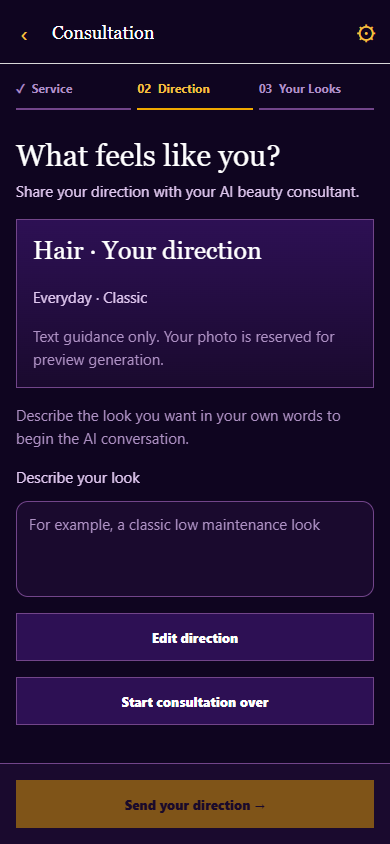
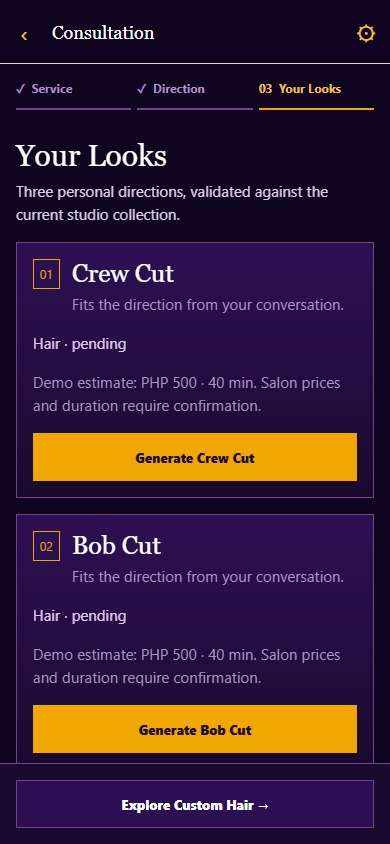
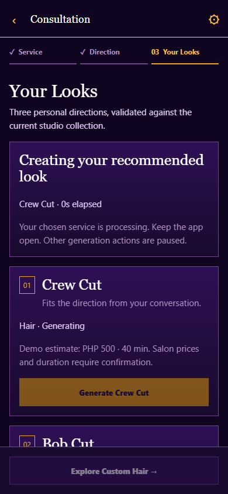
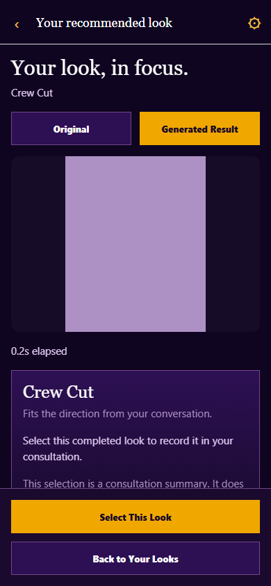
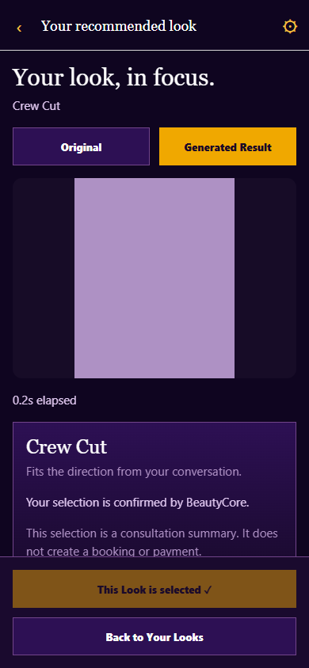
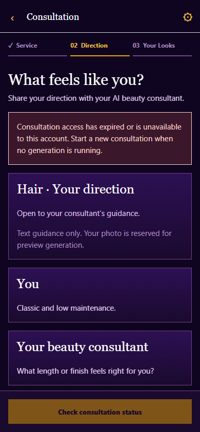

# MOBILE-02C real AI Consultation

2026-10-03, `codex/mobile-02`, baseline `6ce58fb`.

**DONE. MOBILE-02C live Android Hair Consultation gate VERIFIED.** The Supervisor explicitly authorized this phase and defers standalone Android Makeup visual acceptance and standalone Android Nails live generation acceptance. Those deferrals remain outside the representative Hair Consultation gate.

## Inspected integration and implementation

The unchanged BeautyCore adapter already supports every required Consultation operation through Client role checks, mutation Origin enforcement and signed user bound handles. Native cookie behavior was proven in MOBILE-02B and remains the authentication solution. No server authentication adaptation was required. [Exact contracts and safety behavior](../guides/mobile-02c-integration.md).

The existing Service → Direction → Your Looks shell now creates a real consultation, uploads the chosen File multipart image, submits the existing structured preferences, then asks the user for a first text description before calling Gemini. It renders actual returned messages and lets the user answer follow-up questions naturally. Readiness comes from backend `ready_for_recommendation`, never local conversation length or an invented recommendation. The client requires exactly three distinct primary styles and validates primary/complement choices against the active catalog. Estimates use the existing backend `demo_only` metadata, clearly labelled as demo estimates rather than authoritative salon prices.

Gemini receives text only, not the photo. The UI states that distinction. The existing bounded FastAPI store holds the photo/results temporarily. Mobile stores only local photo references, drafts, public user, opaque handle and returned views/results in memory. It does not decode a handle or retain a raw upstream state/photo ID. No new database schema, persistence, provider or server contract exists.

Recommended looks generate only on explicit taps. One shared temporary guard blocks overlap between Consultation and Custom Studios, including duplicate taps, Reset and sign out. No short GPU timeout, fake percentage or automatic generation retry exists. Ambiguous response loss reads status before any decision; unresolved generating/pending or unreadable status retains the guard. A confirmed failed look allows an explicit manual retry. Completed siblings remain available.

Completed cards display the real returned image. The dedicated result route compares Original/Generated Result and confirms Select through the existing endpoint. Custom hands off the local original to the chosen service's style stage without persisting or reuploading it during navigation.

## Local validation

Mobile TypeScript and lint passed. All 36 mobile tests passed, including Consultation tests for route/header/native Origin contracts, projection of server IDs, exact count/readiness/catalog validation, structured preferences, lifecycle, Select, shared generation locking, lost response/status recovery, safe explicit retry, Gemini failure, expired/invalid sessions, wrong result identity, refusal to fake an unconfigured conversational provider and sending the first user description without an empty opening turn. Existing native File encoder and authenticated Custom generation tests remain green.

Backend: 408 passed, one preexisting multipart deprecation warning. BeautyCore: 26 AI adapter/client/studio tests and TypeScript passed. Signed handle tamper/expiry/cross user checks, anonymous/non Client denial, Origin and allowlisted routes remain covered by unchanged server tests.

Expo Doctor passed 21/21. Android and web exports passed. The configured secret scan checked 13 private values across 57 final bundle files with zero matches. The public client setting remains only `EXPO_PUBLIC_API_BASE_URL`. [Scan](mobile-02c-assets/bundle-scan.json).

Seven intercepted PC browser scenario groups passed: additional conversation question before readiness, exact three looks, one generation and Select, original/result, Custom photo/style handoff, Makeup/Nails recommendation contracts without generation, confirmed failure/manual retry, lost response followed by GET, unavailable Gemini, expired handle and user-first conversation without an empty turn. Widths 320/360/390/430 have no horizontal overflow or hidden bottom primary actions. Three generation POSTs were intercepted, with zero real GPU requests. [Harness](mobile-02c-assets/ui-check.cjs), [results](mobile-02c-assets/ui-checks.json). Initial browser startup timed out while Metro's first bundle compiled, then passed with a suitable navigation budget; no product workaround was needed.

## Live Android gate

Existing root launcher reports BeautyCore, FastAPI, configured Gemini and unified Kaggle worker READY. Its private application and API listeners are preserved; the unchanged mobile launcher supplies the public BeautyCore origin only to Expo and reverses ports 3000/8081 over the authorized USB phone. Supervisor confirms the phone is connected and is starting Kaggle. No remote phone taps, navigation, screenshots or file access are performed.

The early real Android attempts reached BeautyCore create 201, FastAPI photo 200, preferences 200 and Gemini turn. Gemini proposed three Hair styles on the empty opening turn. The unchanged backend rejected these with HTTP 502 because at least one user answer is required; **these proposed styles were not saved or validated recommendations**. The interim mobile recovery read saved state once after this definite 502 and permitted a user-authored first description. On the next Android try, the Supervisor confirmed “Describe your look” appeared, sent a description and reported that “See Your Looks” showed three recommendation cards. The application and FastAPI logs confirm the text turn returned HTTP 200 in approximately 4 seconds after the definite opening-turn 502 and state GET. The final mobile flow now starts with that user description and skips the known-bad empty turn entirely; it keeps explicit status reconciliation for ambiguous response loss. This final change passed local tests and browser fixtures and awaits fresh phone proof.

The Supervisor then tapped one recommended Hair generation. Server logs identify `bob_hair` reaching the existing remote inference boundary once, with no automatic retry. The remote returned HTTP 530 after 1.656 seconds; FastAPI and BeautyCore returned 502, and Mobile read saved generation status with GET 200. No image was produced from that attempt. Fresh image-free `/deployment/readiness` reads returned remote HTTP 530 and connection failure. The Supervisor's read-only Kaggle check found both local worker and public tunnel HTTP 200. Signed current endpoint discovery was healthy on the PC, but its launcher identity differed from the owned running backend, proving FastAPI was using a stale temporary endpoint. The unchanged owned launcher stopped/restarted only its local application services against the current signed endpoint, reporting `BEAUTYCORE CAPSTONE READY`; a fresh readiness GET reported `ready=true`, `foundation_load_count=1`, and all three features. The temporary Consultation state was cleared by that necessary restart.

On a fresh Android Consultation with the final user-first mobile flow, the first real text Gemini turn returned HTTP 200 in 6.1 seconds; the Supervisor reported three visible validated recommendations: **Bob Hair, Shoulder Length Hair, Curtain Hair**. One explicit Bob Hair generation followed. BeautyCore POST returned HTTP 200 in 70.0 seconds, FastAPI's remote boundary returned HTTP 200 in 68.969 seconds, and the existing Kaggle worker status records `hairstyle/bob_hair`, `train001` adapter, 20 inference steps, HTTP 200, 65.843 inference seconds and one foundation load. [Safe worker proof](mobile-02c-assets/worker-proof.json), [allowlisted application and backend events](mobile-02c-assets/live-requests.json). The Supervisor manually confirmed the real generated image displayed on Android, Original/Generated Result comparison worked, Select This Look succeeded, and Explore Custom Hair retained the original photo at Style. FastAPI and BeautyCore Select POST both returned 200. No second generation or automatic GPU retry was issued after the earlier 530 failure. The displayed timer value was not transcribed; the timings above are server/worker measurements.

The live proof covers the existing authenticated Client session on Android, real Gemini text conversation, three backend-validated Hair styles, one recommended real Kaggle generation, visible result, Original/Result, Select, and Custom handoff. The server route/status and worker timing are observed logs; the phone image and navigation confirmations are the Supervisor's manual report. No mock response counts as acceptance.

## Protected components and deferred work

No backend, BeautyCore server/web, root/mobile launcher, database schema, Gemini model configuration, prompts, FLUX foundation, adapters, datasets, Kaggle notebook/worker scheduling or Nails pipeline source changed. All changes are mobile integration and focused evidence/context. No automatic additional feature work follows this gate.

Standalone Android Makeup visual acceptance and standalone Android Nails live generation acceptance remain explicitly deferred by Supervisor. They are outside MOBILE-02C completion.

## Review screenshots

These PC fixture screenshots are UI review artifacts, not real AI output or phone captures. The established colors, typography, cards and stages are retained.

