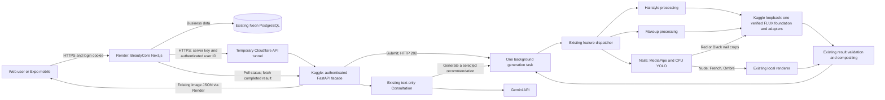

# Render + Kaggle demo deployment

> **Automatic endpoint upgrade, 2026-10-10:** commit `2bba523` is Live with `AI_ENDPOINT_MODE=registered`; the endpoint metadata table is applied. The corrected `render_kaggle_client_demo.ipynb` signs and registers its fresh URL, so the per-run manual URL/deploy steps below apply only to explicit static rollback. [Current client workflow](client-demo-handover.md). Fresh pinned bundle/host/CPU/GPU startup, signed registration, changed-tunnel replacement without Render edits/deploy, heartbeat renewal and signed-in feature discovery passed. Private notebook Version 1 is saved. Full provider restart and real client-account generation remain Needs verification.

> **Historical outage / preparation, 2026-10-09 (superseded by the live automatic connection above):** Render health returns 200; the previous Kaggle tunnel returns 530. The earlier successful startup is historical, not current AI availability. Use the [client handover guide](client-demo-handover.md) and separate corrected `notebooks/render_kaggle_client_demo.ipynb` for a fresh rehearsal. Its 27 local startup/recovery tests pass, but fresh consolidated Kaggle startup and client-account generation are still Needs verification. The original notebook/private archive remain preserved; the original archived runner still needs the recorded manual recoveries.

2026-10-09. **Free Render deployment, Kaggle readiness and live authenticated Consultation start verified. Real image generation acceptance NEEDS VERIFICATION.** Use this guide for a scheduled capstone demonstration. No paid service or change to trained weights is needed. The 2026-10-10 automatic upgrade adds one operational metadata table to existing Neon; business/account tables are unchanged.

## Current cloud preparation, 2026-10-09

The implementation is published on `codex/render-kaggle-demo` (initial code commit `c7fb37e`). The original private GPU and CPU input datasets remain unchanged. After the recorded ensurepip and inline-plotting recoveries, the owner supplied successful CPU package/model checks, GPU bootstrap and `READY_FOR_REHEARSAL`. Independent read-only HTTP checks returned 200 for `/health` with the expected service identifier and 401 for anonymous `/features`. This verifies startup/readiness and the basic public authentication boundary, not real generation.

The owner completed private credential entry and deployed the Free `beautycore-demo` service at `https://beautycore-demo.onrender.com`. The confirmed branch and `beautycore` root are used. The first deployed adapter rejected mutations because Next.js's bound server hostname/port differed from the browser origin. Commit `ddd5961` uses Render's automatic `RENDER_EXTERNAL_URL` for the exact trusted origin and is now Live. The real signed-in demo UI created a consultation, uploaded a synthetic nonpersonal image and received a Gemini opening question without the 403. Application health returned 200 and anonymous AI access returned 401. No GPU image generation was started in that retest; the full image/mobile/restart acceptance checklist remains open.

Keep the running Kaggle session available. Its tunnel URL is temporary and is recorded as session evidence rather than a permanent service address. [Deployed origin fix and live retest](../experiments/render-origin-fix-20261009.json).

[Current readiness and Render handoff evidence](../experiments/render-kaggle-ready-20261009.json).

## Where everything runs

Render runs the full `beautycore/` app as a Node **Web Service**, including authentication and APIs. Do not use a static site or the older `frontend/` folder. Kaggle runs three separate Python environments: the reviewed GPU host, the CPU API with NumPy 1.26/MediaPipe, and CPU Torch/YOLO with NumPy 2.4. No GPU inference runs on Render.

The new notebook exposes only the authenticated facade; GPU calls remain inside Kaggle. This allows a several-minute Nails generation without holding one public request open. The existing generation algorithms, model hashes, catalog, prompts and response validation stay active. Web/mobile accept background tickets but still accept ordinary synchronous responses when using local START.

## 1. Publish the prepared deployment code

Repository confirmed by the owner: `https://github.com/mark-juswa/CometicsAI`. Use the dedicated `codex/render-kaggle-demo` branch containing the current BeautyCore/mobile code and these deployment changes. The repository's old `main` is not the current full application. Do not merge to main or deploy an older branch accidentally. Do not commit `.env`, private ZIP/binary bundles, model files, input photos or generated images.

The root `render.yaml` is the reproducible configuration. The manual dashboard settings below match it.

## 2. Prepare the NEW private Kaggle notebook

Keep SERVER 1/SERVER 2 and all earlier model datasets/notebooks available. Start this new demo in a fresh session; do not run old/new GPU workers simultaneously or reuse their ports. Existing private dataset `cosmetics100/capstone-train002-20260928-v1` can supply the original expanded GPU bundle.

Upload `artifacts/render_kaggle_cpu_20261009.bin` as a **private** dataset. This includes CPU source, pinned requirements, Makeup presets, the existing MediaPipe asset and YOLO checkpoint. It contains no `.env` or keys. Its `.bin` extension preserves the ZIP-format archive as one input file rather than letting Kaggle automatically unpack a `.zip` upload. Attach exactly one copy each of:

- `capstone_train002_20260928_v1.bin` (existing approved GPU bundle, unchanged).
- `render_kaggle_cpu_20261009.bin` (new CPU deployment overlay).

Import `notebooks/render_kaggle_demo.ipynb` into a NEW private notebook. Select T4 GPU and enable Internet. The original bootstrap checks exact reviewed Python/Torch/CUDA/GPU versions and adapter/Base hashes; if Kaggle's host has changed, stop and record the mismatch rather than changing model settings.

Enable these **Kaggle Secrets** for the new notebook:

| Name | Value and destination |
| --- | --- |
| `AI_REMOTE_API_KEY` | Existing GPU key, at least 24 characters; used only between Kaggle API and GPU worker |
| `AI_BACKEND_API_KEY` | NEW random secret, at least 32 characters; the exact same value goes into Render's server environment |
| `GEMINI_API_KEY` | Existing Google AI Studio key for text-only Consultation |
| `HF_TOKEN` | Existing optional token, only if the pinned Base download requires authentication |

Create/copy secrets privately; never paste them into chat, notebook cells, GitHub, frontend variables, screenshots or logs. A local command you can run privately to generate a new random value is `node -e "console.log(require('crypto').randomBytes(48).toString('base64url'))"`. Use independent values for session, handle and backend secrets.

Run Cells 1 → 2 → 3. Cell 1 checks every bundle member and outer hash. Cell 2 installs isolated CPU environments, CPU-only Torch **and matching CPU TorchVision**, preloads the YOLO and MediaPipe assets, preserves the original GPU bootstrap, and starts one API process and one API tunnel. It checks protected public readiness. Cell 3 shows safe session evidence and the URL.

The runner requires at least 30 GiB total **host RAM**, in addition to the GPU; this is a guard based on the earlier GPU peak, not proof that the combined workload fits. Fresh Linux package installation and real combined memory remain acceptance gates. NumPy 1.26 requires the provided OpenCV-contrib 4.11 constraint; do not merge CPU/GPU environments. If PortAudio is absent, the runner installs `libportaudio2` from the system package repository for MediaPipe's audio import dependency.

Copy the printed URL privately into Render's `AI_FASTAPI_URL`. Do not use the GPU's `127.0.0.1:8765` URL there. `READY_FOR_REHEARSAL` means readiness checks passed; it does not mean real generation has passed.

### Recover the early CPU ensurepip failure

If `backend-env-create.log` reports the target Python failing at `-m ensurepip --upgrade --default-pip`, use `notebooks/render_kaggle_cell2_recovery.py` as the entire replacement Cell 2. Keep the extracted inputs and run the replacement directly. It uses the documented host pip `--python` option to install pip 25.3 into CPU environments created with `--without-pip`; application/model dependencies retain their existing pins. It changes the loaded runner only in memory and preserves the uploaded archive hash. Future newly packaged runner source includes this bootstrapping fix.

The replacement refuses active service ports and evidence of later startup stages. It archives only the known early failed `starting` reservation; it does not remove environment directories or bundled source. Recovery behavior passed seven local checks and a real Windows isolated-install smoke test. Actual Kaggle Linux startup and generated outputs remain **NEEDS VERIFICATION**. This cell is specific to the early ensurepip failure, not a general restart command.

### Resume after the MediaPipe inline plotting failure

When `landmark-load.log` shows `ValueError: Key backend: 'module://matplotlib_inline.backend_inline'`, replace Cell 2 with the entire `notebooks/render_kaggle_cell2_resume.py` and run it in the same session. It sets `MPLBACKEND=Agg` only for CPU commands/API, reuses completed installations, reruns package checks and YOLO/MediaPipe loads, then continues the original GPU bootstrap. The notebook host and GPU environment are preserved. It refuses existing GPU/API startup evidence and active service ports, and archives only the identified failed reservation. A preceding missing-wrapt sitecustomize warning is separate; the supplied traceback proves execution continued to the Matplotlib error.

Both recovery cells passed 15 local checks. Actual Kaggle model rechecks and online feature acceptance remain **NEEDS VERIFICATION**. No reset, reupload or dependency reinstall is required for this targeted resume. Keep the early ensurepip cell as historical recovery only; it intentionally refuses this later stage.

## 3. Create the Render service

Use **New → Web Service**, the confirmed repository, and these settings:

| Setting | Value |
| --- | --- |
| Name | `beautycore-demo` (or an available equivalent) |
| Branch | `codex/render-kaggle-demo` |
| Language | Node |
| Root directory | `beautycore` |
| Build command | `npm ci --include=dev && npm run build` |
| Start command | `npm run start -- --hostname 0.0.0.0 --port $PORT` |
| Compute | **Free**; explicitly choose it because the dashboard defaults to paid compute |
| Health path | `/api/health` |
| Auto deploy | Off; update deliberately between demos |

Prefer Singapore if available and convenient for the Philippine demo audience; correctness does not depend on region. Node is pinned to the locally checked `24.7.0` version.

Set only server-side environment variables:

| Render variable | Required value |
| --- | --- |
| `NODE_VERSION` | `24.7.0` |
| `NODE_ENV` | `production` |
| `DATABASE_URL` | Existing Neon PostgreSQL connection string; use its TLS connection settings |
| `SESSION_SECRET` | Fresh random value; Blueprint can generate this |
| `AI_CONSULTATION_HANDLE_SECRET` | Independent random value, at least 32 characters; Blueprint can generate this |
| `AI_BACKEND_MODE` | `kaggle` |
| `AI_BACKEND_API_KEY` | Exact same NEW backend key enabled in Kaggle |
| `AI_FASTAPI_URL` | HTTPS root printed by the new notebook, with no path/query/credentials |

Render automatically supplies `RENDER_EXTERNAL_URL`. The AI routes use this fixed HTTPS application origin for mutation checks because Next.js's reconstructed server URL can use its internal bound hostname/port. No extra Origin variable or CORS bypass is required. Foreign or missing Origin values remain rejected. Local operation keeps its original request-origin comparison when this deployment variable is unset. The current hosted check expects the service's canonical `onrender.com` URL; a future custom domain requires a deliberate canonical-origin configuration change.

The new bridge accepts only an exact HTTPS `*.trycloudflare.com` root in Kaggle mode. Cookies, browser origins and signed-in database roles remain enforced. Keys and IDs supplied by the browser are ignored; the server adds its own trusted values. Do not use any `NEXT_PUBLIC_*` or `EXPO_PUBLIC_*` variable for secrets. GPU, Gemini and HF keys are not needed in Render for these integrated studios.

Keep the existing Neon schema. Do not run `db:push`, `db:seed`, or create Render's temporary free PostgreSQL database as part of this deployment.

## 4. Rehearse the actual complete system

1. Warm Render by opening the site before the audience arrives. `GET /api/health` must return 200. This is application liveness only.
2. Confirm anonymous `/api/ai/features` returns 401 and direct public Kaggle `/features` without its backend key returns 401. Sign in as an existing demo Client; verify catalogs for Hair, Makeup, Nails, and Consultation mode.
3. Generate Hair `crew_cut`, Makeup `natural_makeup`, Nails `classic_red` on an approved hand photo, and Hair again. Verify POST returns a ticket, polling is GET-only, one result is displayed, correct style/adapter provenance is retained, and the GPU foundation load count stays one. Record request statuses and timings, not keys or private photos.
4. Generate renderer-only Nails `nude_pink`; confirm it produces the expected local-renderer metadata and no new Nails GPU request. For model Nails verify outside-mask preservation and image quality. Eight-step Classic Red has prior limited evidence; reduced-step Glossy Black still needs its own quality review.
5. Complete Consultation: service, photo, user direction, three valid Gemini recommendations, one generated recommendation, result display, Select, and Custom photo handoff. No empty opening Gemini turn is sent.
6. Repeat at least one workflow with a large allowed upload/result. Monitor Render RAM through multipart parsing and result delivery, and Kaggle host RAM during segmentation/compositing. Local startup memory is not a loaded Render memory measurement. A free-runtime OOM is a failed deployment gate; do not silently switch to paid compute.
7. Test busy handling using a second signed-in Client while one job runs; it should receive 429 without launching another generation. Check cross-user access to a known job/consultation fails. Test an invalid image/style and interrupted status polling; verify no second POST is issued automatically.
8. For Expo, set only `EXPO_PUBLIC_API_BASE_URL=https://<your-service>.onrender.com` and restart/rebuild the app. Manually check native HTTPS cookies, login, catalogs, generation, Consultation and logout on the phone. No remote phone taps are allowed. Public URL configuration does not itself verify native cookie behavior.
9. End/restart the new notebook; update Render's URL and redeploy. The site must show controlled unavailability before recovery. Start fresh consultations because old photos/results are gone. Record this recovery rehearsal before the defense.

Local automated tests use controlled fixtures, not new GPU-generated pictures. Fresh real online/image quality checks remain **Needs verification** until their evidence is recorded.

## Demo-day operation and limits

Start Kaggle early enough for package installation and model download/loading, then update Render's endpoint and wait for its deploy/warmup. Keep the notebook running during the demo. One facade generation runs at a time; other attempts fail busy rather than queueing. Only the newest three jobs are retained, for at most 30 minutes from creation. Do not treat job history as permanent storage. Existing consultations expire after about an hour and remain process-local.

A lost submission response is ambiguous: the job may already be running. Do not resubmit automatically. If a Consultation job is interrupted, use its existing generation-status read; for a manual request without its returned ticket, have the operator check the active session before an explicit retry. A page/app reload can lose local drafts/tickets. Notebook restart discards all temporary AI state.

Render free services sleep after idle periods and can restart. Kaggle GPU capacity/session limits, package/model download availability, and temporary tunnel health remain external dependencies. There is no always-on guarantee. The browser-facing uploads remain limited to 8 MiB JPEG/PNG; generated results are relayed through Render as the existing inline-image JSON. Free-tier memory, bandwidth, and combined Kaggle resource use must pass rehearsal.

Official references: [Render Next.js deployment](https://render.com/docs/deploy-nextjs-app), [Render free limits](https://render.com/docs/free), [Render Blueprint settings](https://render.com/docs/blueprint-spec), and [Cloudflare connection limits](https://developers.cloudflare.com/fundamentals/reference/connection-limits/).

## Roll back

Stop only the new demo notebook/session. Leave original model datasets and old notebooks intact. Locally use the existing START/STOP and old signed-discovery notebook; local `AI_BACKEND_MODE` is unset so the original loopback bridge and synchronous handlers stay active. If the old GPU session ended, start its original notebook rather than assuming it is still running. No silent failover or duplicate retry is introduced.

The Render service can be suspended while fixing a demo problem. Do not edit the old working `.env` or rotate its GPU key to repair the new deployment. Deploy an earlier code revision deliberately if needed; do not reuse expired AI handles/jobs after a restart.
